# Visualisierungen interpretieren

Wir verwenden Plots, um Muster in unseren Daten besser zu erkennen und zu interpretieren. Dabei nutzen wir aus, dass wir die Verhältnisse und Beziehungen zwischen den Daten in Plots darstellen können. Wir nutzen dabei aus, dass `ggplot` einfache Auswertungen für uns durchführen kann. 

Alle Visualisierungen helfen uns zusätzlich zu den Lagemassen eines Vektors ein Gefühl für die Verteilung unserer Daten zu erhalten.

Wir Veranschaulichen uns die Techniken der visuellen Interpretation mit Hilfe der Stichprobe aus unserer Umfrage vom Semesteranfang.

<p class="alert alert-warning"><b>Achtung</b>: Die visuelle Interpretation von Daten gibt uns eine Orientierung, aber keine objektive Gewissheit. Wir verwenden visuelle Interpretationen ausschliesslich zum besseren Verständnis unserer empirischen Ergebnisse. Plots ohne zugehörige Analysen sind grundsätzlich zu vermeiden.</p>


```R
library(tidyverse)
```

    ── Attaching packages ─────────────────────────────────────── tidyverse 1.3.0 ──
    
    ✔ ggplot2 3.3.2     ✔ purrr   0.3.4
    ✔ tibble  3.0.3     ✔ dplyr   1.0.2
    ✔ tidyr   1.1.2     ✔ stringr 1.4.0
    ✔ readr   1.3.1     ✔ forcats 0.5.0
    
    ── Conflicts ────────────────────────────────────────── tidyverse_conflicts() ──
    ✖ dplyr::filter() masks stats::filter()
    ✖ dplyr::lag()    masks stats::lag()
    


```R
daten = read_csv2("umfragedaten_ui2020.csv")
```

    Using ',' as decimal and '.' as grouping mark. Use read_delim() for more control.
    
    Parsed with column specification:
    cols(
      .default = col_double(),
      `Abgegeben:` = col_character(),
      Q00_Demo.Gen = col_character(),
      Q00_Demo.Age = col_character(),
      Q01_Demo.Work = col_character(),
      Q02_Demo.Workload = col_character(),
      Q03_Demo.Studyload = col_character(),
      Q04_Demo.Study.Len = col_character(),
      Q05_Demo.Study.Deg = col_character(),
      Q07_Demo.Deg.Other = col_character(),
      Q09_L.Spend.single = col_character(),
      Q10_L.Spend.abo = col_character(),
      Q11_Mob.Typ = col_character(),
      Q13_M.Age = col_character(),
      Q14_M.Ver.Android = col_character(),
      Q15_M.Ver.IOS = col_character(),
      Q16_M.Use.Apps = col_character(),
      Q19_G.Dev.Other = col_character()
    )
    
    See spec(...) for full column specifications.
    


Wir vereinfachen die Vektorennamen, so dass wir einfacher mit den Daten arbeiten können. Die Vorgehensweise ist im Abschnitt "Datenquellen" genauer erklärt.


```R
tibble(namen = daten %>% names()) -> vektorNamen 

vektorNamen %>% 
    mutate(
        # problematische Symbole und Klammern aus den Namen entfernen
        namen = namen %>% 
                    str_to_lower() %>% 
                    str_replace_all(c(
                        "\\." = "_"
                    )),
        # überlange Namen vereinfachen
        prefix = namen %>% str_extract("[^-]+(?=->)"),
    ) %>%
    # Fragebatterien zuerst zusammenfassen
    group_by(prefix) %>%
    # Fragebatterien durchnummerieren
    mutate(
        nummer = 1:length(prefix),
        namen_kurz = str_c(prefix, "_", nummer),
        namen_kurz = coalesce(namen_kurz, namen)
    ) -> vektorNamen

daten %>% 
    setNames(vektorNamen %>% pull(namen_kurz)) %>% 
    rename(q00_digitalisiert = q00_att_digital_self_1) %>%
    mutate(
        across(starts_with("q"), ~replace_na(.x, -1))
    ) -> datenSauber
```

Für die visuelle Interpretation und zum ersten Verständnis unserer Daten helfen uns die folgenden Darstellungsformen: 

* Histogramme
* Box-Whisker-Diagramme
* Punktwolken

## Histogramme

Historgramme sind Balkendiagramme, die uns die Häufigkeiten von Werten in unseren Stichproben anzeigen. Diese Plots entsprechen den Ergebnissen der `count()`-Funktion.

Histogramme sind hervorragend dazu geeignet uns einen visuellen Eindruck über die Verteilung der Werte eines Vektors zu geben.

Zur Erstellung von Histogrammen stehen uns zwei Funktionen zur Verfügung: 

1. `geom_histogram()`
2. `geom_bar()`

Beide Funktionen können einen Vektor automatisch zusammenfassen. 

Falls wir mit `count()` oder ähnlichen Funktionen unsere Stichprobe bereits zusammengefasst haben, dann verwenden wir anstatt der obigen Funktionen immer die `geom_col()`-Funktion.


```R
datenSauber %>% 
    count(q00_demo_gen) 

datenSauber %>% 
    ggplot(aes(x = q00_demo_gen)) +
        geom_bar()
```


<table>
<caption>A spec_tbl_df: 3 × 2</caption>
<thead>
	<tr><th scope=col>q00_demo_gen</th><th scope=col>n</th></tr>
	<tr><th scope=col>&lt;chr&gt;</th><th scope=col>&lt;int&gt;</th></tr>
</thead>
<tbody>
	<tr><td>1 : Keine Angabe</td><td>  1</td></tr>
	<tr><td>2 : Weiblich    </td><td> 95</td></tr>
	<tr><td>3 : Männlich    </td><td>104</td></tr>
</tbody>
</table>


    
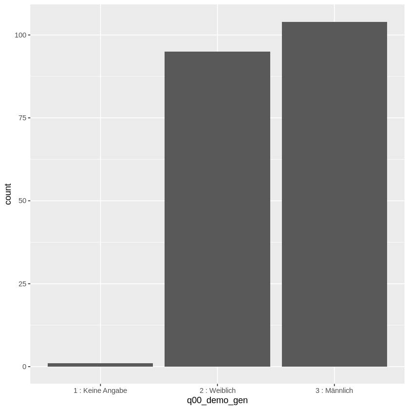
    


Um ein Histogramm einschätzen zu können, bietet es sich an, die Daten mit einer Referenzverteilung zu vergleichen.

Um das zu illustrieren verwenden wir den Vektor `q00_digitalisierung`.


```R
datenSauber %>% 
    count(q00_digitalisiert) 

datenSauber %>%
    ggplot(aes(x = q00_digitalisiert)) +
         geom_bar()
```


<table>
<caption>A spec_tbl_df: 6 × 2</caption>
<thead>
	<tr><th scope=col>q00_digitalisiert</th><th scope=col>n</th></tr>
	<tr><th scope=col>&lt;dbl&gt;</th><th scope=col>&lt;int&gt;</th></tr>
</thead>
<tbody>
	<tr><td>2</td><td> 8</td></tr>
	<tr><td>3</td><td>25</td></tr>
	<tr><td>4</td><td>57</td></tr>
	<tr><td>5</td><td>71</td></tr>
	<tr><td>6</td><td>34</td></tr>
	<tr><td>7</td><td> 5</td></tr>
</tbody>
</table>


    
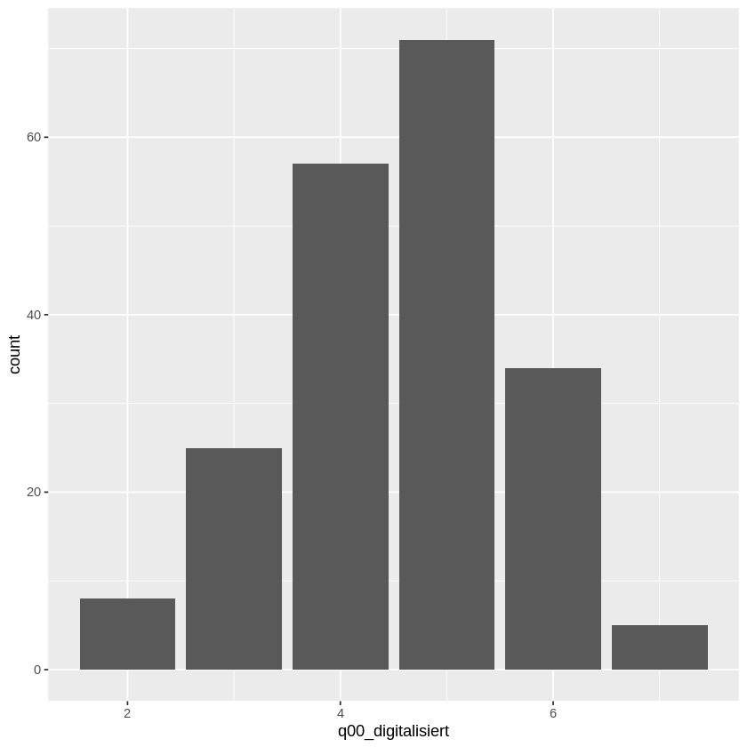
    


Diese Verteilung sieht fast wie die Glockenkurve einer Normalverteilung aus. Wir wollen nun visuell überprüfen, ob unser Histogramm der Normalverteilung folgt.

Dazu zeigen wir uns zuerst die Normalverteilung an.


```R
tibble(x = c(-3, 3)) %>%
    ggplot(aes(x)) +  
    stat_function(fun = dnorm, 
                      n = 101, 
                      args = list(mean = 0, sd = 1), 
                      color = "red")
```


    
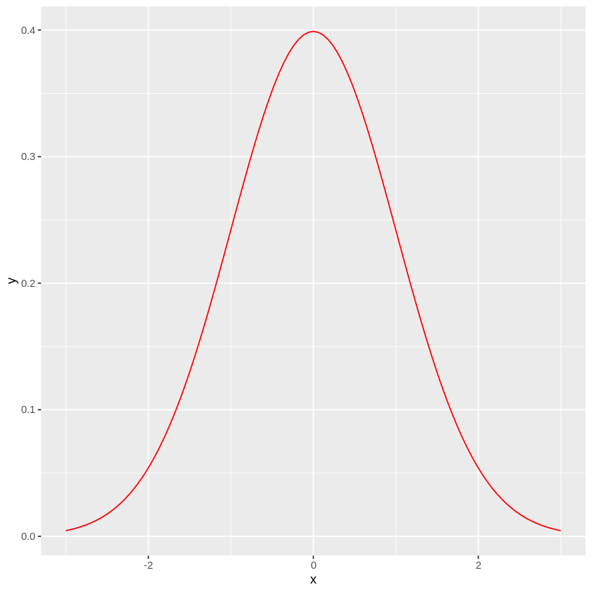
    


Diese Kurve möchten wir nun über unseren Plot legen. Dazu müssen wir über eine Lineartransformation die Normalverteilung an den Mittelwert und die Standardabweichung unserer Stichprobe ausrichten. Wir müssen also zuerst diese Lagemasse bestimmen. 


```R
datenSauber %>% 
    summarise(m = mean(q00_digitalisiert), 
              sd = sd(q00_digitalisiert)) -> lagemasse

mw = lagemasse %>% pull(m)
sd = lagemasse %>% pull(sd)

mw
sd

```


4.565


1.10992552604525


Mit dem Mittelwert und der Standardabweichung können wir nun die Normalverteilung für den Wertebereich unseres Vektors zeichnen.


```R
datenSauber %>%
    ggplot(aes(x = q00_digitalisiert)) +
    stat_function(fun = dnorm, 
                      n = 101, 
                      args = list(mean = mw, sd = sd), 
                      color = "red")
```


    
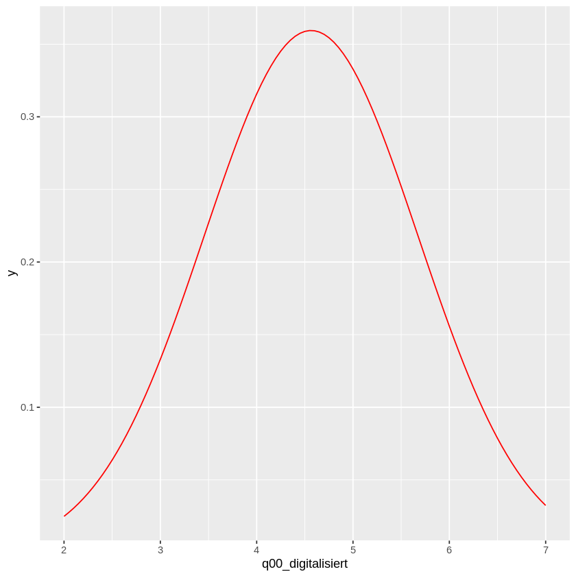
    


Wir haben ja gelernt, dass wir Geometrien überlagern können und das versuchen wir jetzt.


```R
datenSauber %>%
    ggplot(aes(x = q00_digitalisiert)) +
    geom_bar() +
    stat_function(fun = dnorm, 
                      n = 101, 
                      args = list(mean = mw, sd = sd), 
                      color = "red")
```


    
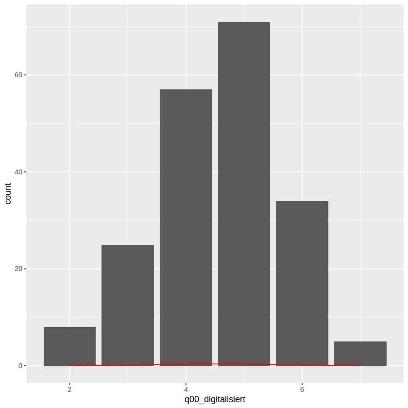
    


Unser neuer Plot zeigt uns jetzt eine kleine rote Kurve am unteren Rand des Koordinatensystems. Das ist nicht unser gewünschtes Ergebnis. Woran kann das liegen?

Dazu vergleichen wir die Werte auf der y-Achse für die angepasste Normalverteilung und unseres überlagerten Plots. Uns fällt dabei auf, dass die Werte in den beiden Plots stark von einander abweichen. Die Ursache ist  dafür, dass die Normalverteilung *relative Werte* annimmt und unser Histogramm aber die *absoluten Werte* anzeigt. Wir müssen deshalb unsere absoluten Werte in relative Werte umwandeln. Das  erreichen wir indem wir die aggregierten Werte im Vektor `n` durch  die Gesamtzahl aller Antworten teilen. Diese Anzahl entspricht die Summe der Nennungen im gesamten Wertebereich. 


```R
datenSauber %>% 
    count(q00_digitalisiert) %>% 
    mutate(relativ = n/sum(n)) -> Auswertung

Auswertung
```


<table>
<caption>A spec_tbl_df: 6 × 3</caption>
<thead>
	<tr><th scope=col>q00_digitalisiert</th><th scope=col>n</th><th scope=col>relativ</th></tr>
	<tr><th scope=col>&lt;dbl&gt;</th><th scope=col>&lt;int&gt;</th><th scope=col>&lt;dbl&gt;</th></tr>
</thead>
<tbody>
	<tr><td>2</td><td> 8</td><td>0.040</td></tr>
	<tr><td>3</td><td>25</td><td>0.125</td></tr>
	<tr><td>4</td><td>57</td><td>0.285</td></tr>
	<tr><td>5</td><td>71</td><td>0.355</td></tr>
	<tr><td>6</td><td>34</td><td>0.170</td></tr>
	<tr><td>7</td><td> 5</td><td>0.025</td></tr>
</tbody>
</table>


Mit diesen relativen Werten können wir nun unsere gemessene Verteilung mit der Normalverteilung vergleichen. 


```R
Auswertung %>%
    ggplot(aes(x = q00_digitalisiert, y = relativ)) +
        geom_col(fill = "lightgrey") +
        stat_function(fun = dnorm, 
                      n = 101, 
                      args = list(mean = mw, sd = sd), 
                      color = "red") +
        theme_bw()
```


    
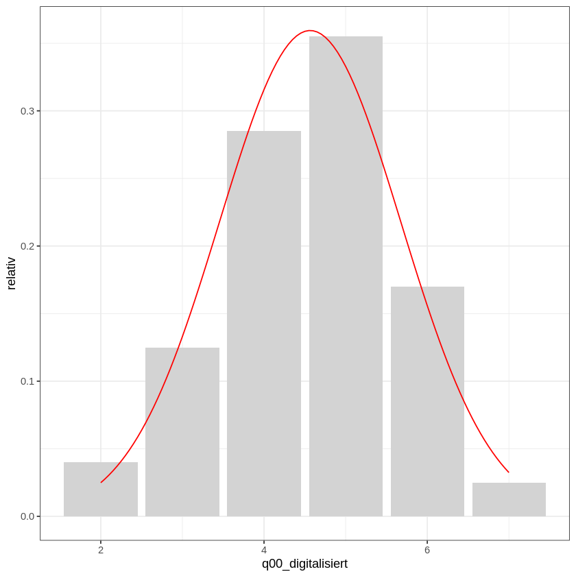
    


Jetzt können wir leicht erkennen, dass die Verteilung der Werte  im Vektor `q00_digitalisiert` fast perfekt der Normalverteilung folgt.

## Box-Whisker-Diagramme

Box-Whisker-Diagramme oder Box-Plots sind Darstellungen der Quartile einers Vektors. 

Der Median wird beim Boxplot als Linie und die Quartile um den Median werden als Rechteck (Box) angezeigt. Die Box zeigt uns daher den sog. *Interquartilsabstand*. Die anderen beiden Quartile werden als Linien (Whiskers) dargestellt. Wir können uns diese Darstellung wie die (sehr abstrakte) Schnauze einer Katze vorstellen. 

Wenn Sie mit grossen Wertebereichen arbeiten, bestimmt `ggplot` ausserdem Ausreisser und Extremwerte und stellt diese im Plot dar.

Das folgende Beispiel zeigt ein Box-Whisker-Diagramm für den Vektor `q08_a_newdev_12`. 


```R
datenSauber  %>%
    filter(q08_a_newdev_12 >= -1) %>%
    ggplot(aes(x = q08_a_newdev_12)) +
        geom_boxplot() 
```


    
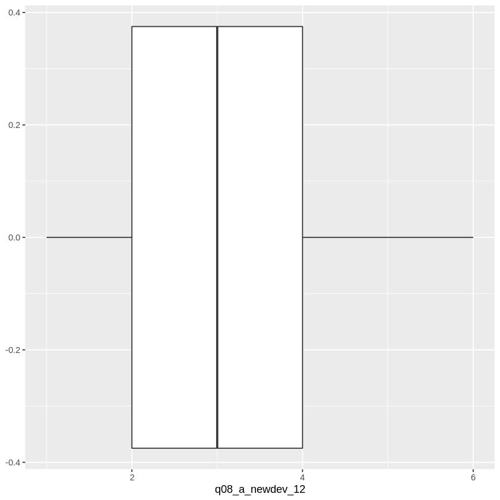
    


Gelegentlich wollen wir die Quartile mehrere Vektoren  miteinander vergelichen. Weil wir für die X-Achse und die Y-Achse jeweils nur einen Vektor mit `ggplot` verwenden können, müssen wir in diesem Fall unsere Stichprobe mit `pivot_longer()` transformieren.

Dafür erstellen wir einen Vektor, der den ursprünglichen Vektornamen enthält (in diesem Beispiel `vektoren`), und einen Vektor, der die jeweiligen Werte enthält (hier  `werte`). In der Praxis müssen wir regelmässig ungültige Daten entfernen (bzw. heraus*filtern*). Das erreichen wir mit der `filter()`-Funktion.

Nach dieser Transformation können wir `ggplot()` für die beiden neu erstellten Vektoren ganz normal verwenden. 

Im Beispiel verwende ich am Abschluss die `coord_flip()`-Funktion, um die Lesbarkeit des Plots zu verbessern. 

Die `pivot_longer()` erzeugt aus den Vektorennamen einen Vektor mit sogenannten **diskreten Werten**. Solche Werte werden in R als sog. Faktoren gespeichert. R versucht für Faktoren eine sinnvolle Reihenfolge zu bestimmen. In der Praxis sind diese Versuche selten passend. Damit solche Werte in der richtigen Reihenfolge dargestellt werden, müssen wir sie meistens selbst in die richtige Reihenfolge bringen. In diesem Beispiel mache ich das mit Hilfe der Funktionen `fct_inorder()` und `fct_rev()`. Nur so kann ich sicherstellen, dass die Reihenfolge der Werte auf der `vektoren`-Achse angemessen sortiert sind. 


```R
datenSauber %>%
    select(starts_with("q08_")) %>%
    # Transformieren
    pivot_longer(starts_with("q08_"), 
                 names_to = "vektoren", 
                 values_to = "werte") %>%
    # Ungültige Werte entfernen
    filter(werte >= -1) %>%
    # Vektorennamen aufsteigend sortieren
    mutate(
        vektoren = vektoren %>% fct_inorder() %>% fct_rev() 
    ) %>%
    # BoxPlots erstellen
    ggplot(aes(x = vektoren, y= werte)) +
        geom_boxplot() +
        coord_flip()
```


    
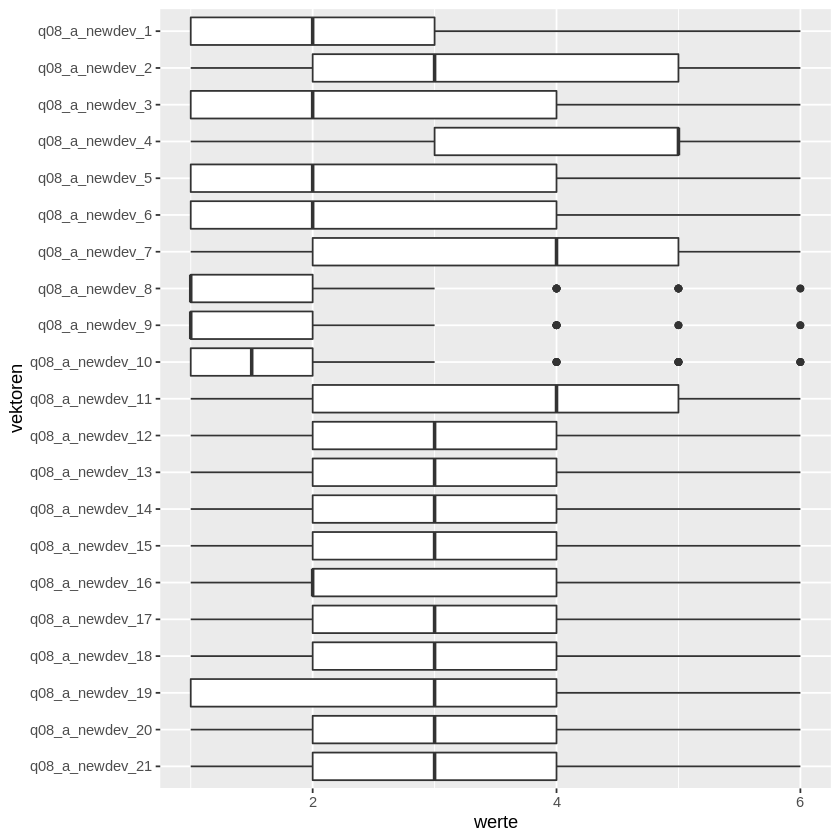
    


## Punktwolken

Die dritte wichtige visuelle Analysetechnik sind Punktwolken. Bei Punktwolken stellen wir die Werte von zwei Vektoren ähnlich einer Kreuztabelle gegenüber und überprüfen das gemeinsame Auftreten von Werten in den Vektoren unserer Messungen.

Für Punktwolken stehen zwei Funktionen zur Verfügung: 

1. `geom_point()` für kontinuierliche Werte.
2. `geom_jitter()` für diskrete Werte.


```R
datenSauber %>%
    filter(q08_a_newdev_15 >= -1 & q08_a_newdev_16 >= -1 ) %>%
    ggplot(aes(x = q08_a_newdev_15, y= q08_a_newdev_16)) + 
        geom_point()
```


    
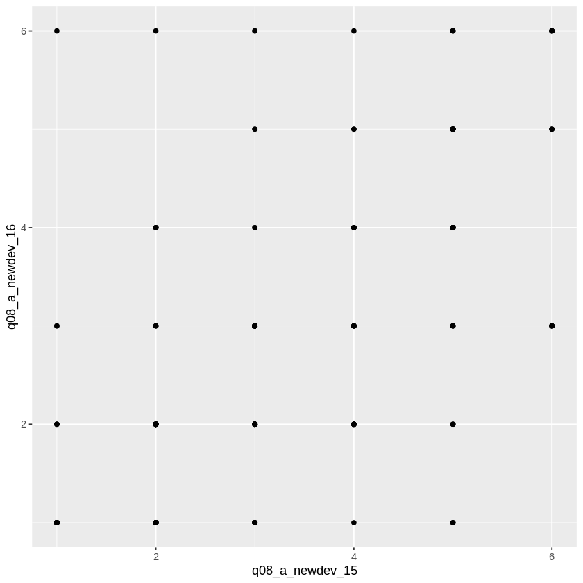
    


In diesem Beispiel sehen wir, dass alle Werte genau an den gleichen Punkten im Koordinatensystem liegen. Ein solcher Plot ist ein gutes Beispie für *diskrete Werte*. Bei diskreten Werten fallen alle Messungen genau auf bestimmte Punkte im Wertebereich. Kontinuierliche Werte weichen oft ein wenig voneinander ab, so dass wir eine Wolke sehen würden. 

Um Punktwolken für diskrete Werte zu erzeugen verwenden wir die `geom_jitter()`-Funktion. Diese Funktion erzeugt einen kleinen Bereich um den diskreten (echten) Messwert und verteilt die einzelnen Datensätze mit einem zufälligen Abstand vom echten Messwert. Dadurch wird das gemeinsame Auftreten von Werten deutlich sichtbar, sofern es gemeinsamkeiten gibt.


```R
datenSauber %>%
    filter(q08_a_newdev_15 >= -1 & q08_a_newdev_16 >= -1 ) %>%
    ggplot(aes(x = q08_a_newdev_15, y= q08_a_newdev_16)) + 
        geom_jitter()
```


    
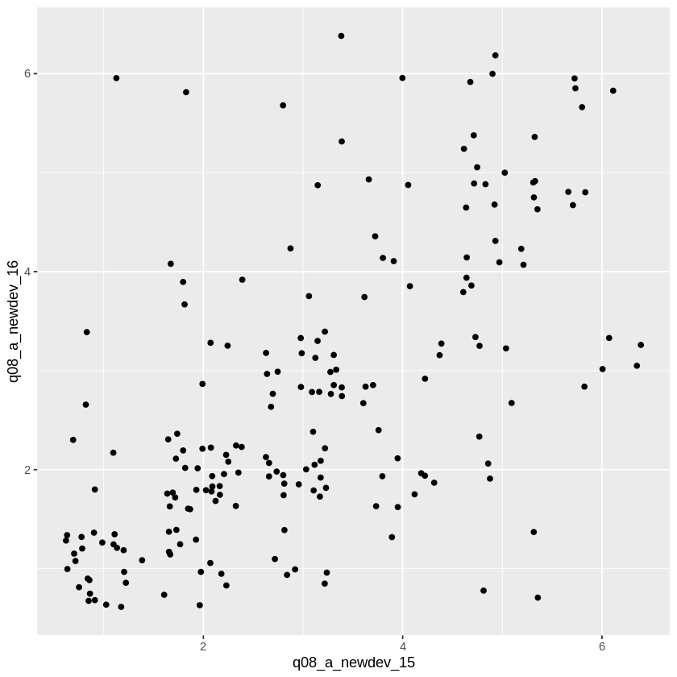
    


Durch den leichten Versatz sind nun gehäufte Wertepaare leicher zu erkennen. Bei Jitter-Plots dürfen wir aber nie vergessen, dass die Punkte zwar Messungen repräsentieren, die Punkte leicht vom echten Messpunkt versetzt dargestellt wurden.

In diesem Beispiel können wir eine Häufung entlang der nach rechts aufsteigenden Diagonalen erkennen. Solche Häufungen in Punktwolken deuten auf *Korrelationen* hin. 

<p class="alert alert-primary">Eine <b>Korrelation</b> bezeichnet das wiederholte Auftreten von bestimmten Werte<i>paaren</i> in Stichproben. Korrelationen deuten auf zusammenhänge zwischen zwei Vektoren hin.</p>

Ähnlich wie beim Vergleichen mit Histogrammen ist es bei Punktwolken hilfreich, für die Wolke eine Referenz zur Orientierung zu haben. Das erreichen wir mit der `geom_smooth()`-Funktion. Die Methode `lm` steht für "Lineares Modell" und zieht eine Ausgleichsgerade. Der graue Bereich zeigt uns die Spanne des Fehlerbereichs für diese Gerade. Bei einer linearen Korrelation sollte diese Gerade sollte den Häufungen in unserem Plot ungefähr folgen.


```R
datenSauber %>%
    filter(q08_a_newdev_15 >= -1 & q08_a_newdev_16 >= -1 ) %>%
    ggplot(aes(x = q08_a_newdev_15, y= q08_a_newdev_16)) + 
        geom_jitter() +
        geom_smooth(method="lm")
```

    `geom_smooth()` using formula 'y ~ x'
    


    
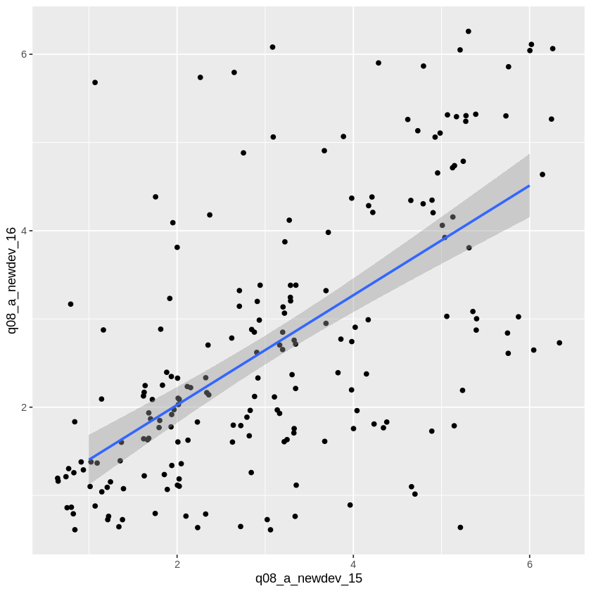
    


Das folgende Beispiel zeigt eine Punktwolke, bei denen die Wertepaare zufällig über den gesamten Wertebereich gestreut sind. In diesem Fall ist eine Korrelation kaum wahrscheinlich. 


```R
datenSauber %>%
    filter(q08_a_newdev_21 >= -1 & q08_a_newdev_20 >= -1 ) %>%
    ggplot(aes(x = q08_a_newdev_21, y= q08_a_newdev_20)) + 
        geom_jitter() 
```

    `geom_smooth()` using formula 'y ~ x'
    


    
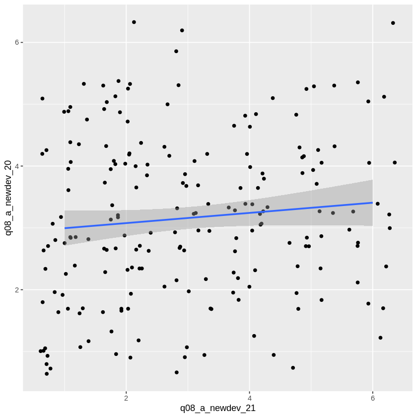
    


Wenn eine Ausgleichsgerade wie im Beispiel fast waagerecht ist, dann liegt in der Regel auch keine *Korrelation* vor.

Es gibt auch nicht-linare Korrelationen. In diesem Fall sehen wir Häufungen in bestimmten Teilen unserer Punktwolken oder unsere Punkte folgen einer Kurve. Solche Korrelationen müssten einer entsprechenden "Ausgleichskurve" folgen. Eine solche Ausgleichskurve erzeugen wir mit `loess` als Ausgleichsmethode. 

Wenn eine AUsgleichskurve fast gerade ist, dann sollten wir eine lineare Korrelation annehmen. 


```R
datenSauber %>%
    filter(q08_a_newdev_15 >= -1 & q08_a_newdev_16 >= -1 ) %>%
    ggplot(aes(x = q08_a_newdev_15, y= q08_a_newdev_16)) + 
        geom_jitter() +
        geom_smooth(method = "loess")
```

    `geom_smooth()` using formula 'y ~ x'
    


    
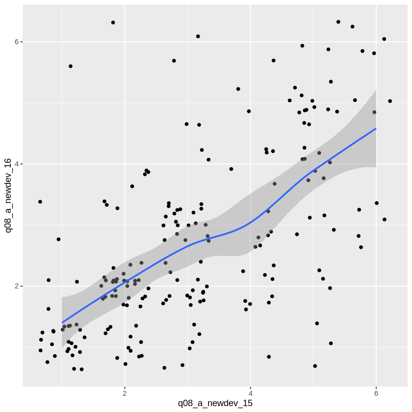
    


```R

```
