```R
library(tidyverse)
```

    ── Attaching packages ─────────────────────────────────────── tidyverse 1.3.0 ──
    
    ✔ ggplot2 3.3.2     ✔ purrr   0.3.4
    ✔ tibble  3.0.3     ✔ dplyr   1.0.2
    ✔ tidyr   1.1.2     ✔ stringr 1.4.0
    ✔ readr   1.3.1     ✔ forcats 0.5.0
    
    ── Conflicts ────────────────────────────────────────── tidyverse_conflicts() ──
    ✖ dplyr::filter() masks stats::filter()
    ✖ dplyr::lag()    masks stats::lag()
    


# Visualisieren mit ggplot

Das Buch ggplot2 (Wickham, 2021) gibt einen guten Überblick über die Visualisierungstechniken in R (und anderen Data Science Sprachen). Speziell das Kapitel 2 erklärt alle wichtigen Elemente, um mit R unsere Daten zu visualisieren.

In diesem Abschnitt erläutere ich die Verbindungen zu den anderen Konzepten in diesem Kurs und hebe die wichtigsten Aspekte der Datenvisualisierung hervor.

## Grundbegriffe 

Bei der visuellen Darstellung von Daten unterscheiden wir zwischen `Tabellen` und `Plots`. Tabellen stellen einen oder mehr Vektoren gegenüber. Tabellen organisieren die Daten in Zeilen und Spalten. Dabei stehen die Werte im Zentrum der Darstellung. In solchen Fällen sprechen wir von einer *tabellarischen Darstellung*. 

Die typischen tabellarischen Darstellungen sind die **Werteliste** und die **Kreuztabelle**.

<p class="alert alert-primary"><b>Definition</b>: Als <i>Plots</i> werden graphische Darstellungen von Daten bezeichnet, die Verhältnisse und Beziehungen von Werten hervorheben.</p> 

<p class="alert alert-warning"><b>Wichtig</b>: In Publikationen und Forschungsberichten werden Plots als <i>Abbildungen</i>  getrennt von Tabellen gekennzeichnet.</p>

Ein Plot baut sich aus **verschiedenen Ebenen** auf. Zu diesen Ebenen gehören unter Anderem:

* Das Koordinatensystem,
* Überschriften,
* Beschriftungen,
* Legenden sowie 
* die Darstellung der Daten.

`ggplot` hilft uns diese Ebene gezielt und unabhängig voneinander anzusprechen und zu komplexen Visualisierungen zu verknüpfen.

## ggplot2 und die Funktionsverkettung 

Der erste und vielleicht schwierigste Teil ist die Funktionsverkettung. Bisher haben wir den Verkettenoperator `%>%` verwendet, um Funktionen zu verketten. Der `%>%`-Operator funktioniert leider nicht mit `ggplot`. Stattdessen müssen wir das Pluszeichen (`+`) verwenden, wenn wir die Funktionen von `ggplot` zu einem Plot verketten wollen.

<p class="alert alert-success"><b>Merke</b>: Bis zur <code>ggplot()</code>-Funktion dürfen wir den `%>%` für Funktionsketten verwenden.<br>
Ab der <code>ggplot()</code>-Funktion müssen wir das `+` zur Funktionsverkettung verwenden.</p>

Mit der `ggplot()`-Funktion signalisieren wir R, dass wir nun einen Plot aufbauen. Nachdem wir einen Plot eingeleitet haben, dürfen wir nur noch Funktionen zur Anpassung der *Ebenen* des Plots aufrufen.

Für eine einfache Visualisierung brauchen wir Daten.


```R
daten0 = tibble(
    a = c(1,2,3,4),
    b = c(4,7,2,9)
)
```

Diese Daten enthalten 2 Vektoren `a` und `b`. Ein einfaches Balkendiagram für diese beiden Vektoren erhalten wir wie folgt.


```R
daten0 %>% 
    ggplot(aes(x = a, y = b)) + 
        geom_col() # Balkendiagramm mit expliziter x und y-Achse
```


    
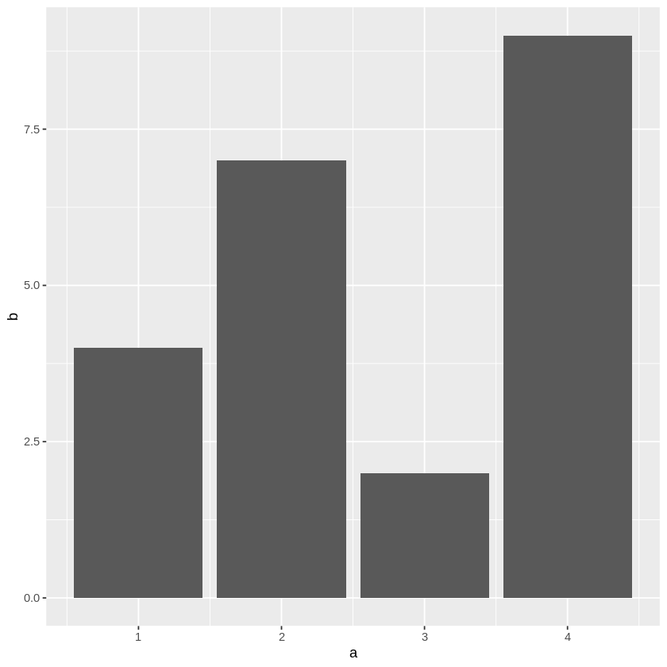
    


Dieses Beispiel zeigt uns ein wichtiges Element für Visualisierungen: Ein Plot hat immer eine *Dimensionalität*. Die Dimensionen eines Plots legen wir mit der `aes()`-Funktion fest. Mit dieser Funktion signalisieren wir ggplot, welche Vektoren wir welchen Achsen, Flächen oder Farben zuordnen. Üblicherweise übergeben wir diese Zuordnung der `ggplot()`-Funktion und initialisieren so unseren Plot.

<p class="alert alert-success"><b>Merke</b>: Eine Dimension für eine Visualisierung sollten genau einem Vektor zugeordnet werden.</p>

Die dritte Zeile erstellt eine Ebene in unserem Plot. Die Funktion `geom_col()` erzeugt ein Balkendiagramm entlang der Werte im a- und b-Vektor.

In diesem einfachen Beispiel sehen wir Die normale Funktionsverkettung mit `%>%` sowie die Funktionsverkettung mit `+` für Visualisierungen.

<p class="alert alert-success"><b>Merke</b>: Visualisierungen stehen <b>immer</b> am Ende von Funktionsketten.</p>

## Aufbau von Grafiken

Mit `ggplot` werden Grafiken über Ebenen aufgebaut. Wir bauen eine Visualisierung nach der folgenden Regeln auf: 

1. Die Geometrie der Daten mit den `geom_`-Funktionen.
2. Die Skalierung mit den `scale_`-Funktionen.
3. Das Koordinatensystem mit den `coord_`-Funktionen.
4. Beschriftungen mit der `labs()`-Funktion
5. Formatierungen, Schriftgrössen usw. mit der `theme`-Funktion.

In jeden Schritt können wir verschiedene Visualisierungen übereinander zu legen. Dabei müssen wir beachten, dass die Reihenfolge der Aufrufe entscheidend ist. Spätere Aufrufe werden über die früheren Aufrufe im gleichen Schritt gelegt. Das folgende Beispiel illustriert das.


```R
daten0 %>% 
    ggplot(aes(x = a, y = b)) +
        # Geometrie
        geom_col() +
        geom_line(color = "red") + 
        # Beschriftungen
        labs(title = "B über A mit Linie im Vordergrund") +
        # Formatierung
        theme(plot.title = element_text(size = "24"))

daten0 %>% 
    ggplot(aes(x = a, y = b)) + 
        geom_line(color = "red") +
        geom_col() + 
        labs(title = "B über A mit Linie im Hintergrund") +
        theme(plot.title = element_text(size = "24"))

```


    
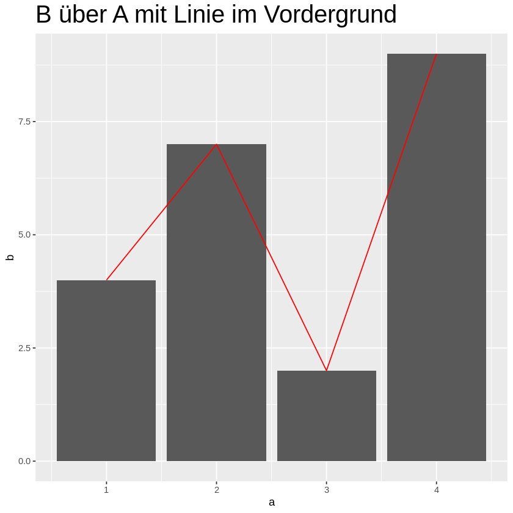
    


    
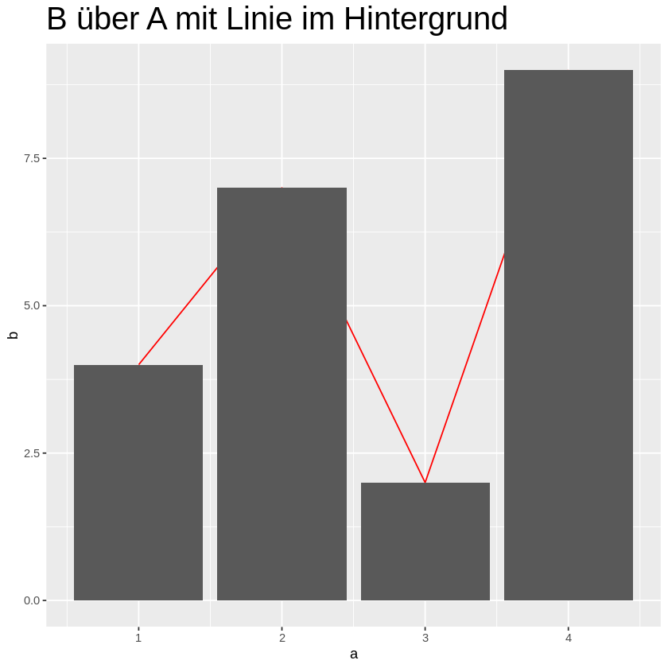
    


## Autostatistik, Koordinatensysteme und Formatierungsthemen

R kann auch Plots erstellen, die nur einen Datenvektor umfassen. In diesem Fall wird der zweite Vektor für die y-Achse aus den Werten des Vektors berechnet. Diese Möglichkeit benutzten wir in R regelmässig, um z.B. Histogramme zu erstellen und so einen Überblick über die Verteilung unserer Werte zu erhalten. 

Nehmen wir das folgende Beispiel: Wir erstellen ein Stichprobenobjekt mit einem Vektor `q00_demo_gen`, der die Werte `1 : Keine Angabe`, `2 : Weiblich` und `3 : Männlich` enthält. Jeder Wert entspricht einer Messung.


```R
daten2 = tibble(
    q00_demo_gen = c("2 : Weiblich", "2 : Weiblich", "3 : Männlich", 
"2 : Weiblich", "2 : Weiblich", "2 : Weiblich", "2 : Weiblich", 
"2 : Weiblich", "2 : Weiblich", "3 : Männlich", "3 : Männlich", 
"3 : Männlich", "3 : Männlich", "2 : Weiblich", "2 : Weiblich", 
"3 : Männlich", "3 : Männlich", "2 : Weiblich", "3 : Männlich", 
"2 : Weiblich", "2 : Weiblich", "2 : Weiblich", "2 : Weiblich", 
"3 : Männlich", "2 : Weiblich", "3 : Männlich", "2 : Weiblich", 
"3 : Männlich", "3 : Männlich", "2 : Weiblich", "2 : Weiblich", 
"3 : Männlich", "2 : Weiblich", "3 : Männlich", "2 : Weiblich", 
"3 : Männlich", "2 : Weiblich", "2 : Weiblich", "3 : Männlich", 
"2 : Weiblich", "2 : Weiblich", "2 : Weiblich", "2 : Weiblich", 
"3 : Männlich", "3 : Männlich", "2 : Weiblich", "2 : Weiblich", 
"3 : Männlich", "3 : Männlich", "2 : Weiblich", "3 : Männlich", 
"3 : Männlich", "2 : Weiblich", "2 : Weiblich", "2 : Weiblich", 
"3 : Männlich", "2 : Weiblich", "3 : Männlich", "3 : Männlich", 
"3 : Männlich", "2 : Weiblich", "3 : Männlich", "3 : Männlich", 
"2 : Weiblich", "2 : Weiblich", "3 : Männlich", "2 : Weiblich", 
"2 : Weiblich", "2 : Weiblich", "2 : Weiblich", "3 : Männlich", 
"3 : Männlich", "3 : Männlich", "2 : Weiblich", "3 : Männlich", 
"3 : Männlich", "3 : Männlich", "3 : Männlich", "3 : Männlich", 
"3 : Männlich", "3 : Männlich", "3 : Männlich", "2 : Weiblich", 
"3 : Männlich", "2 : Weiblich", "2 : Weiblich", "2 : Weiblich", 
"2 : Weiblich", "3 : Männlich", "3 : Männlich", "3 : Männlich", 
"3 : Männlich", "3 : Männlich", "3 : Männlich", "2 : Weiblich", 
"2 : Weiblich", "3 : Männlich", "3 : Männlich", "2 : Weiblich", 
"3 : Männlich", "3 : Männlich", "2 : Weiblich", "2 : Weiblich", 
"2 : Weiblich", "3 : Männlich", "3 : Männlich", "2 : Weiblich", 
"2 : Weiblich", "2 : Weiblich", "2 : Weiblich", "2 : Weiblich", 
"2 : Weiblich", "2 : Weiblich", "2 : Weiblich", "3 : Männlich", 
"3 : Männlich", "2 : Weiblich", "3 : Männlich", "2 : Weiblich", 
"3 : Männlich", "3 : Männlich", "3 : Männlich", "3 : Männlich", 
"3 : Männlich", "3 : Männlich", "3 : Männlich", "3 : Männlich", 
"2 : Weiblich", "3 : Männlich", "3 : Männlich", "2 : Weiblich", 
"3 : Männlich", "3 : Männlich", "2 : Weiblich", "3 : Männlich", 
"2 : Weiblich", "3 : Männlich", "2 : Weiblich", "2 : Weiblich", 
"3 : Männlich", "2 : Weiblich", "3 : Männlich", "3 : Männlich", 
"2 : Weiblich", "3 : Männlich", "3 : Männlich", "3 : Männlich", 
"3 : Männlich", "2 : Weiblich", "3 : Männlich", "2 : Weiblich", 
"2 : Weiblich", "3 : Männlich", "2 : Weiblich", "2 : Weiblich", 
"3 : Männlich", "2 : Weiblich", "3 : Männlich", "3 : Männlich", 
"3 : Männlich", "2 : Weiblich", "3 : Männlich", "2 : Weiblich", 
"2 : Weiblich", "3 : Männlich", "2 : Weiblich", "2 : Weiblich", 
"3 : Männlich", "2 : Weiblich", "3 : Männlich", "3 : Männlich", 
"2 : Weiblich", "3 : Männlich", "3 : Männlich", "3 : Männlich", 
"3 : Männlich", "2 : Weiblich", "2 : Weiblich", "2 : Weiblich", 
"2 : Weiblich", "1 : Keine Angabe", "3 : Männlich", "3 : Männlich", 
"2 : Weiblich", "2 : Weiblich", "2 : Weiblich", "2 : Weiblich", 
"3 : Männlich", "3 : Männlich", "3 : Männlich", "3 : Männlich", 
"3 : Männlich", "3 : Männlich", "3 : Männlich", "3 : Männlich", 
"2 : Weiblich", "3 : Männlich", "2 : Weiblich", "3 : Männlich", 
"2 : Weiblich")
)
```

Uns interessiert nun, wie oft kommen die drei möglichen Werte in unserer Stichprobe vor? Wir können die Werte mit `count()` selbst berechnen oder `ggplot` die Arbeit überlassen. Anstelle der `geom_col()`-Funktion verwenden wir nun die `geom_bar()`-Funktion. `geom_bar()` erwartet einen Vektor für die x-Achse und berechnet für die y-Achse das auftreten der Werte, so wie wir das mit der `count()`-Funktion tun würden.

Wir verwenden solche Plots, um interessante Verteilungen in unseren Daten zu entdecken. Balkendiagramme, die Verteilungen darstellen werden übrigens als *Historgramme* bezeichnet.


```R
daten2 %>%
    count(q00_demo_gen)

daten2 %>%
    ggplot(aes(x = q00_demo_gen)) +
        geom_bar()
```


<table>
<caption>A tibble: 3 × 2</caption>
<thead>
	<tr><th scope=col>q00_demo_gen</th><th scope=col>n</th></tr>
	<tr><th scope=col>&lt;chr&gt;</th><th scope=col>&lt;int&gt;</th></tr>
</thead>
<tbody>
	<tr><td>1 : Keine Angabe</td><td>  1</td></tr>
	<tr><td>2 : Weiblich    </td><td> 95</td></tr>
	<tr><td>3 : Männlich    </td><td>104</td></tr>
</tbody>
</table>


    

    


Mit diesem Plot können wir die Unterschiede in unserer Werteverteilung leichter erkennen. 

Für Präsentationen ist so ein Plot aber nicht wahnsinnig attraktiv. Färben wir den Plot also ein. Das machen wir indem wir den Vektornamen auch für die Füllung der Balken verwenden. `ggplot` wählt nun für jeden Wert in unserem Vektor eine eigene Farbe aus. Dadurch färben sich unsere Balken ein. 


```R
daten2 %>%
    ggplot(aes(x=q00_demo_gen, fill = q00_demo_gen)) +
        geom_bar()
```


    
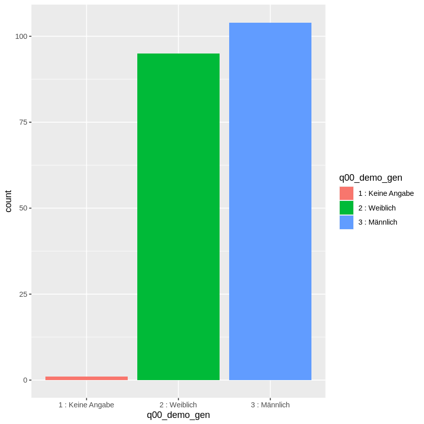
    


Für Histogramme verwenden wir normaler Weise ein karthesisches Koordinatensystem. Wir können aber auch ein anderes Koordinaten System wählen. Eine Variate wären polare Koordinaten, die wir mit der `coord_polar()`-Funktion erzeugen. Mit einem polaren Koordinatensystem erreichen wir kreisförmige Darstellungen. Wir müssen dazu die Dimension, die auf das Zentrum des Diagramms zeigt festlegen und als Parameter übergeben. In unserem Fall ist das die y-Dimension.


```R
daten2 %>%
    ggplot(aes(x=q00_demo_gen, fill = q00_demo_gen)) +
        geom_bar() +
        coord_polar("y") 
```


    
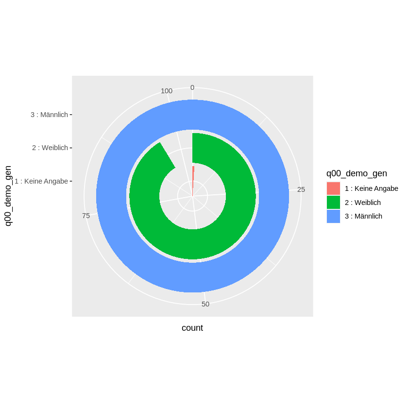
    


Unser Plot hat jetzt aber unschöne Beschriftungen. Die werden wir mit einem Formatierungsthema los. `ggplot` hat verschiedenen Formatierungen als Thema vordefiniert. Eines davon ist das Thema "void". Diese Formatierung entfernt alle Hintergründe, Achsen und Beschriftungen mit Ausnahme von Legenden.


```R
daten2 %>%
    ggplot(aes(x=q00_demo_gen, fill = q00_demo_gen)) +
        geom_bar() +
        coord_polar("y") +
        theme_void()
```


    
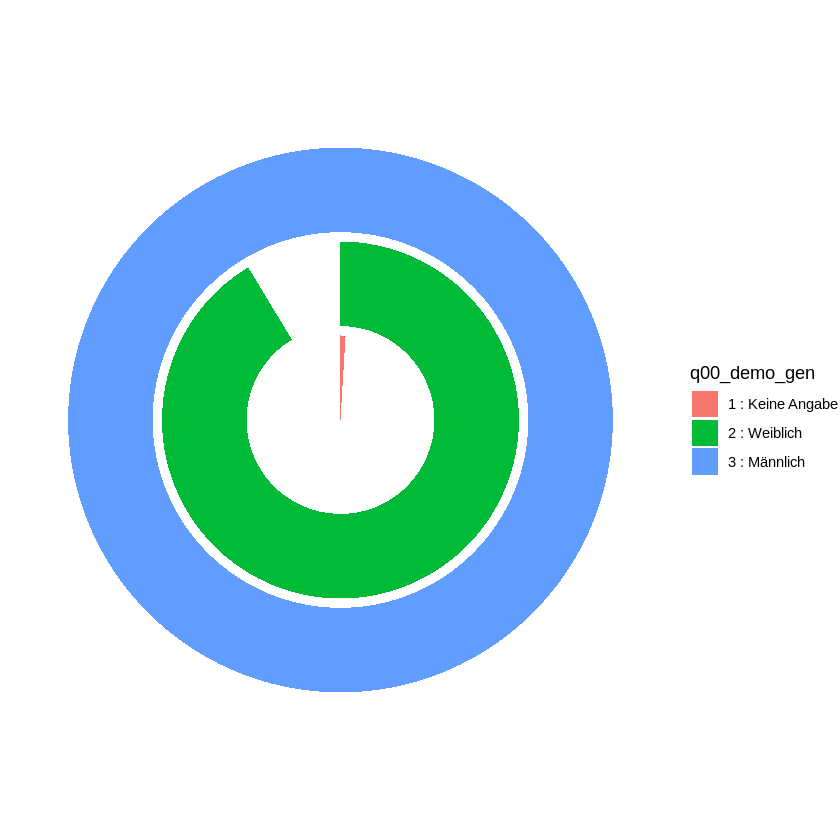
    


Manchmal wollen wir die Balken aber übereinander stapeln. Das erreichen wir, indem wir für die x-Achse einen konstanten Wert angeben. Z.B. nehmen wir dazu den Wert "".


```R
daten2 %>%
    ggplot(aes(x ="", fill = q00_demo_gen)) +
        geom_bar() 
```


    
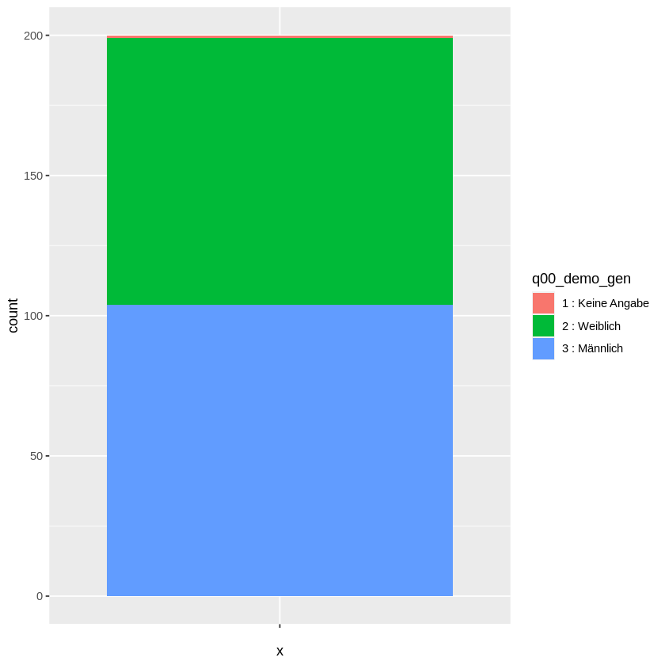
    


Mit der Funktion `coord_flip` vertauschen wir die Achsen und drehen so unser Diagram.


```R
daten2 %>%
    ggplot(aes(x ="", fill = q00_demo_gen)) +
        geom_bar() +
        coord_flip()
```


    
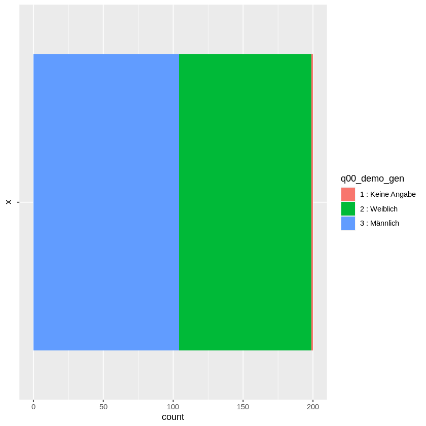
    


Wir erkennen nun deutlich, dass `ggplot` immer versucht möglichst viel Fläche zu nutzen. 

Das Interessante an dieser Darstellung ist aber nicht dieses Format, sondern dass wir dieses Diagram ebenfalls in einem polaren Koordinatensystem darstellen können. 


```R
daten2 %>%
    ggplot(aes(x ="", fill = q00_demo_gen)) +
        geom_bar() +
        coord_polar("y") + 
        theme_void()
```


    
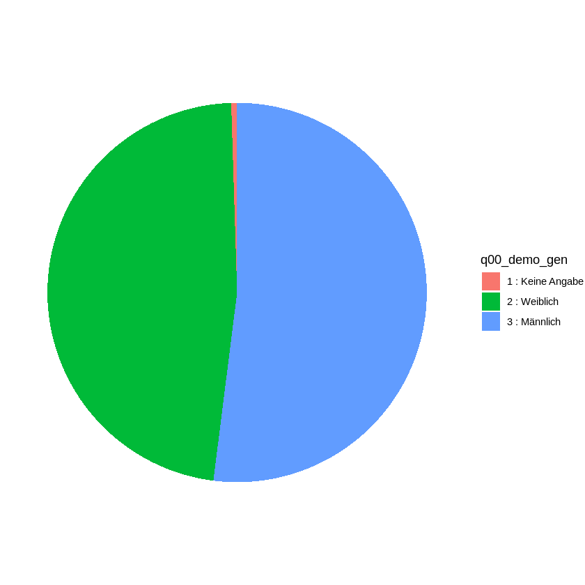
    


Auf diese Weise erzeugen wir Tortendiagramme.

<p class="alert alert-warning"><b>Achtung:</b> Totendiagramme und Donut-Diagramme werden oft falsch interpretiert, weil Kreisflächen schwerer verglichen werden können als höhen von Balken. Sie sollten nur zur Illustration aber nie zur Argumentation verwendet werden.</p>

## ggplot und Variablen

`ggplot` hilft uns eine Visualisierung schrittweise durch Funktionsaufrufe aufzubauen. Wir können die zwischenschritte 


```R
daten3 = tibble(
    a = runif(15, min = 3, max = 10) %>% trunc(),
    b = runif(15, min = 2, max = 17) %>% trunc()
)
```

<p class="alert alert-info">Die <code>runinf()</code>-Funktion gibt uns Zufallszahlen zurück. Der erste Parameter teilt mit, wie viele Werte erzeugt werden sollen. Wenn wir Ganzzahlen möchten, dann müssen wir den Nachkommateil mit <code>trunc()</code> entfernen.</p>

Unsere Vektoren können wir nun visualisieren. Anstatt aber alle Schritte auf einmal durchzuführen, speichern wir die Zwischenschritte in Variablen. So können wir später entscheiden, wie wir etwas visualisieren möchten. Der Vorteil von Variablen ist, dass wir allgemeine Teile der Visualisierung zusammenfassen können und dann in unterschiedlichen Darstellungen verwenden können.


```R
daten3 %>%
    ggplot(aes(x = a)) -> p_a

p_a + geom_bar()
p_a + geom_boxplot()

daten3 %>%
    ggplot(aes(x = b)) -> p_b
```


    
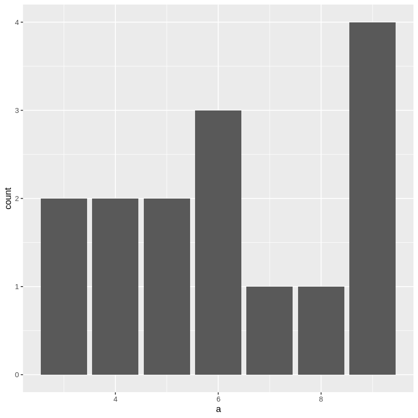
    


    
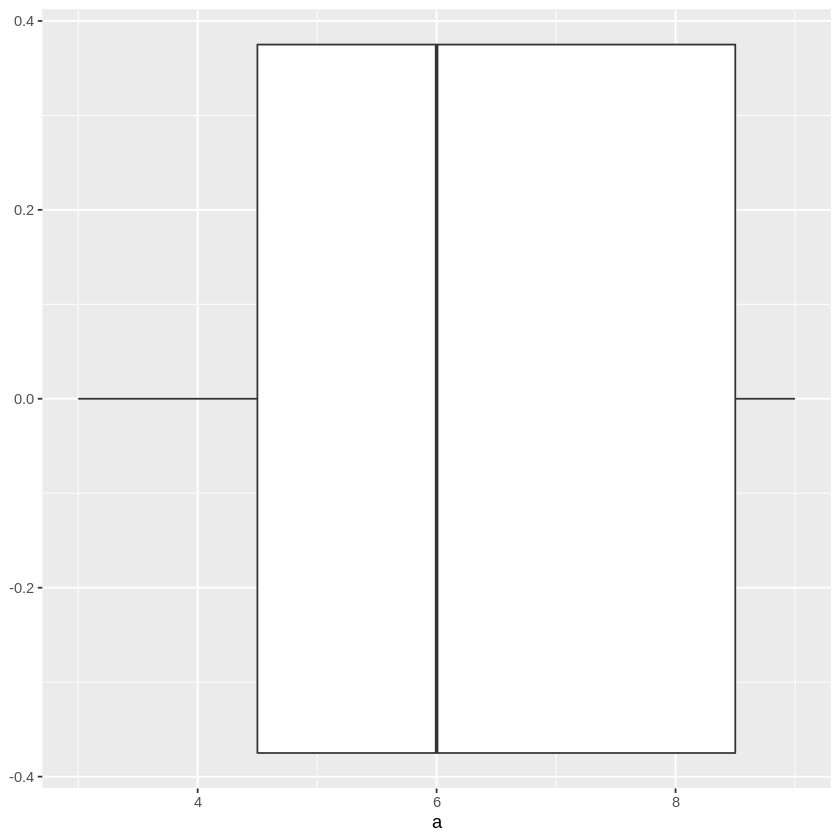
    


Mit Hilfe der Variablen können wir verschiedene Visualisierungsschritte auch auf mehrere Code-Zellen verteilen. 


```R
p_b + geom_boxplot()
p_b + geom_bar()
```


    
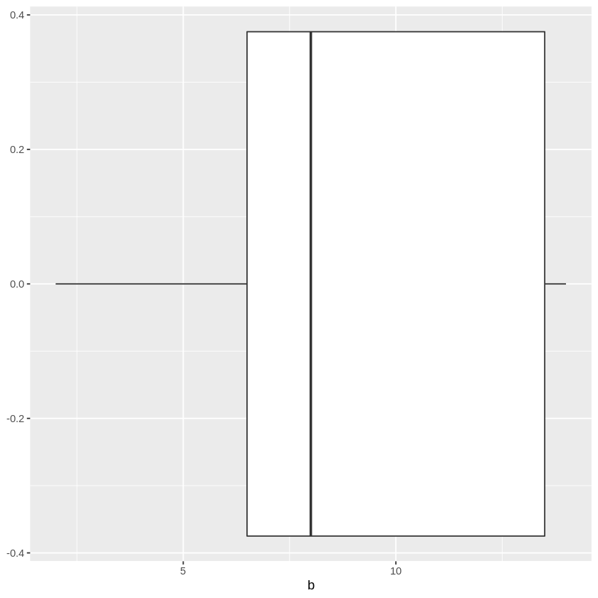
    


    
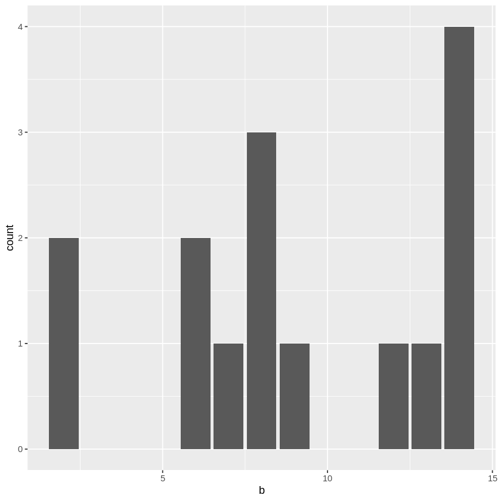
    


```R

```
